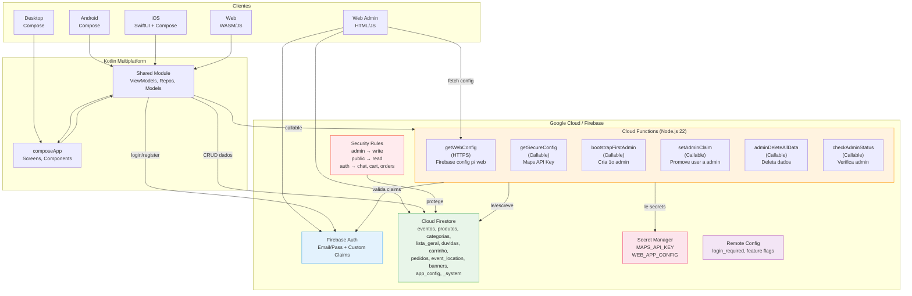

# MakeLifeBetter - Arquitetura do Projeto

## Diagrama Geral (ASCII)

```
┌─────────────────────────────────────────────────────────────────────────────┐
│                          MakeLifeBetter - Arquitetura                       │
└─────────────────────────────────────────────────────────────────────────────┘

┌──────────┐   ┌──────────┐   ┌──────────┐   ┌──────────┐   ┌──────────────┐
│ Android  │   │   iOS    │   │   Web    │   │ Desktop  │   │  Web Admin   │
│ (Compose)│   │(SwiftUI +│   │ (WASM/  │   │(Compose) │   │  (HTML/JS)   │
│          │   │ Compose) │   │  JS)     │   │          │   │              │
└────┬─────┘   └────┬─────┘   └────┬─────┘   └────┬─────┘   └──────┬───────┘
     │              │              │              │                  │
     └──────┬───────┴──────┬───────┘              │                  │
            │              │                      │                  │
     ┌──────▼──────┐ ┌─────▼──────┐               │                  │
     │  Shared KMP │ │ composeApp │               │                  │
     │  (Kotlin)   │ │  (Compose  │               │                  │
     │             │ │Multiplatf.)│               │                  │
     │• ViewModels │ │• Screens   │               │                  │
     │• Repositories│ │• Components│               │                  │
     │• Models     │ │• Navigation│               │                  │
     └──────┬──────┘ └─────┬──────┘               │                  │
            │              │                      │                  │
            └──────┬───────┘                      │                  │
                   │                              │                  │
                   ▼                              ▼                  ▼
┌─────────────────────────────────────────────────────────────────────────────┐
│                        Google Cloud / Firebase                              │
│                                                                             │
│  ┌─────────────────────────────────────────────────────────────────────┐    │
│  │                    Cloud Functions (Node.js 22)                      │    │
│  │                                                                     │    │
│  │  ┌──────────────┐ ┌──────────────────┐ ┌────────────────────────┐  │    │
│  │  │ getWebConfig  │ │ getSecureConfig  │ │ bootstrapFirstAdmin    │  │    │
│  │  │ (HTTPS)       │ │ (Callable)       │ │ (Callable)             │  │    │
│  │  │ Retorna       │ │ Retorna Maps     │ │ Cria 1o admin          │  │    │
│  │  │ Firebase      │ │ API Key          │ │ (Custom Claims)        │  │    │
│  │  │ config p/ web │ │ p/ autenticados  │ │ so funciona 1 vez      │  │    │
│  │  └──────────────┘ └──────────────────┘ └────────────────────────┘  │    │
│  │                                                                     │    │
│  │  ┌──────────────┐ ┌──────────────────┐ ┌────────────────────────┐  │    │
│  │  │setAdminClaim  │ │adminDeleteAllData│ │ checkAdminStatus       │  │    │
│  │  │ (Callable)    │ │ (Callable)       │ │ (Callable)             │  │    │
│  │  │ Promove user  │ │ Deleta dados     │ │ Verifica se e admin    │  │    │
│  │  │ a admin       │ │ (admin only)     │ │                        │  │    │
│  │  └──────────────┘ └──────────────────┘ └────────────────────────┘  │    │
│  └─────────────────────────────────────────────────────────────────────┘    │
│                                                                             │
│  ┌────────────────┐  ┌────────────────┐  ┌──────────────────────────────┐  │
│  │  Firebase Auth  │  │   Firestore    │  │     Secret Manager           │  │
│  │                 │  │                │  │                              │  │
│  │ • Email/Pass   │  │ • eventos      │  │ • MAPS_API_KEY               │  │
│  │ • Custom Claims│  │ • produtos     │  │ • WEB_APP_CONFIG             │  │
│  │   (admin:true) │  │ • categorias   │  │                              │  │
│  │                 │  │ • lista_geral  │  └──────────────────────────────┘  │
│  └────────────────┘  │ • duvidas      │                                    │
│                       │ • carrinho     │  ┌──────────────────────────────┐  │
│  ┌────────────────┐  │ • pedidos      │  │     Remote Config            │  │
│  │ Security Rules │  │ • event_location│  │                              │  │
│  │                │  │ • banners      │  │ • login_required             │  │
│  │ admin → write  │  │ • app_config   │  │ • feature flags              │  │
│  │ public → read  │  │ • _system      │  │                              │  │
│  │ auth → chat,   │  │   (bootstrap)  │  └──────────────────────────────┘  │
│  │  cart, orders  │  │                │                                    │
│  └────────────────┘  └────────────────┘                                    │
│                                                                             │
└─────────────────────────────────────────────────────────────────────────────┘

┌─────────────────────────────────────────────────────────────────────────────┐
│                          Fluxo de Seguranca                                 │
│                                                                             │
│  1. User faz login → Firebase Auth gera JWT token                          │
│  2. bootstrapFirstAdmin → setCustomUserClaims({admin: true}) no JWT        │
│  3. Toda request leva o JWT → Cloud Functions valida admin claim            │
│  4. Firestore Rules usa request.auth.token.admin == true                   │
│  5. Secrets (Maps Key, Web Config) ficam no Secret Manager, nunca no repo  │
└─────────────────────────────────────────────────────────────────────────────┘
```

## Diagrama Mermaid

Para visualizar, cole o codigo abaixo no [Mermaid Live Editor](https://mermaid.live).



## Firestore Security Rules

| Collection | Read | Write |
|---|---|---|
| `app_config` | Publico | Admin |
| `eventos` | Publico | Admin |
| `produtos` | Publico | Admin |
| `categorias` | Publico | Admin |
| `event_location` + `contacts` | Publico | Admin |
| `banners` | Publico | Admin |
| `users/{userId}` | Proprio user | Proprio user |
| `lista_geral` | Autenticado | Autenticado |
| `carrinho` + `items` | Autenticado | Autenticado |
| `pedidos` | Autenticado | Autenticado |
| `duvidas` + `respostas` | Autenticado | Autenticado |
| `_system` | Bloqueado | Bloqueado |

## Cloud Functions

| Function | Tipo | Protecao | O que faz |
|---|---|---|---|
| `getWebConfig` | HTTPS | Nenhuma (config e publico) | Retorna Firebase config para web app |
| `getSecureConfig` | Callable | Autenticado | Retorna Maps API Key |
| `bootstrapFirstAdmin` | Callable | Autenticado (1 vez) | Configura primeiro admin via Custom Claims |
| `setAdminClaim` | Callable | Admin only | Promove outro usuario a admin |
| `adminDeleteAllData` | Callable | Admin only | Deleta dados de todas as collections |
| `checkAdminStatus` | Callable | Autenticado | Verifica se usuario e admin |

## Secrets (Firebase Secret Manager)

| Secret | Usado por | Motivo |
|---|---|---|
| `MAPS_API_KEY` | `getSecureConfig` | Google Maps API Key - nao expor no client |
| `WEB_APP_CONFIG` | `getWebConfig` | Firebase config JSON - nao commitar no repo |
