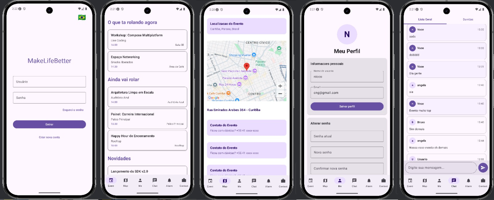
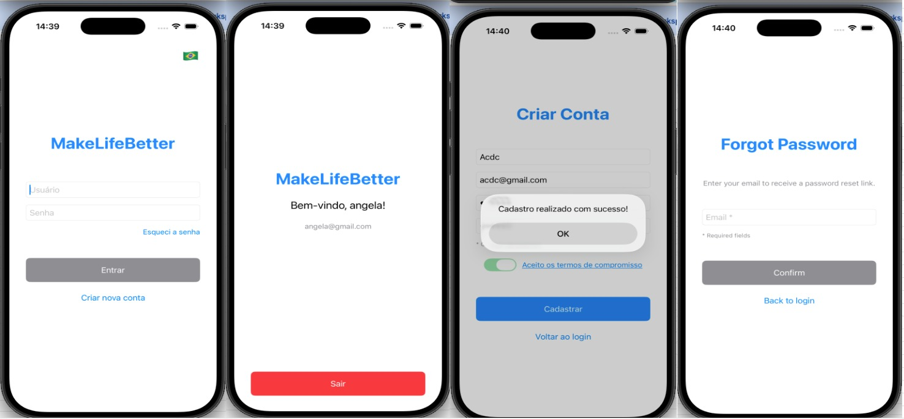
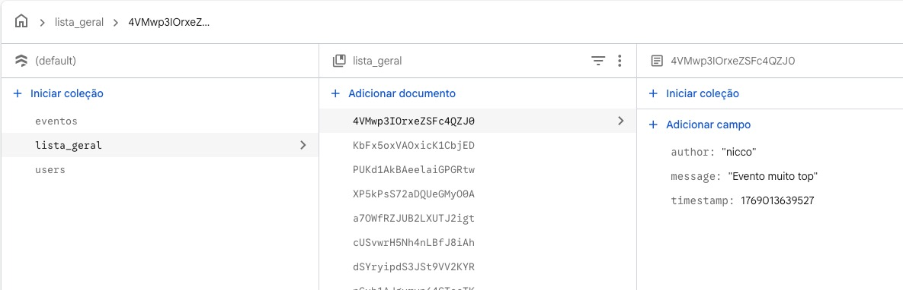
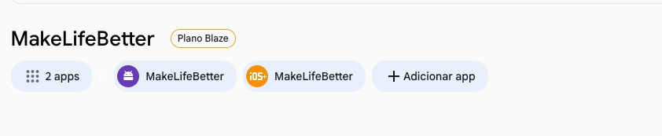

# MakeLifeBetter

A **Kotlin Multiplatform (KMP)** event management and community engagement application built with Compose Multiplatform and SwiftUI, targeting Android, iOS, Web, and Desktop from a single shared codebase.

---

## Overview

MakeLifeBetter helps communities organize and participate in events. Users can browse categorized events, view event locations on a map, chat in real time, receive scheduled notifications, and manage their profiles — all powered by Firebase and delivered across multiple platforms.

---

## Demo

### Video Walkthrough

A full app demonstration video is available in the repository:

[App_full_stage_2.mov](evidence/App_full_stage_2.mov)

### Screenshots

| All Screens | iOS | Firebase | Play Store |
|---|---|---|---|
|  |  |  |  |

---

## Features

| Feature | Description |
|---|---|
| **Event Management** | Browse events organized by category ("happening now" / "scheduled"), with detailed views for each event |
| **Interactive Map** | View event locations with native map integration (Google Maps on Android, MapKit on iOS) |
| **Real-Time Chat** | General chat and Q&A system with questions, replies, and author attribution |
| **Notifications** | Automatic scheduling of reminders 5 minutes before each event, with permission handling per platform |
| **User Authentication** | Email/password login, registration, password recovery, and temporary password flow |
| **Profile Management** | Edit username, email, and change password from the profile screen |
| **Multilingual Support** | Runtime language switching between Portuguese, English, and Spanish |
| **Excel Import** | Bulk import events, locations, and contacts from `.xlsx` files via an admin panel |
| **Admin Panel** | Hidden secret screen for populating sample data, clearing the database, and importing spreadsheets |

---

## Tech Stack

### Core

| Technology | Version |
|---|---|
| Kotlin | 2.3.0 |
| Compose Multiplatform | 1.10.0 |
| Kotlin Coroutines | 1.10.2 |
| Kotlin Serialization | 1.7.3 |
| Kotlin DateTime | 0.7.1 |

### Firebase

| Library | Version |
|---|---|
| Firebase Auth (GitLive) | 2.1.0 |
| Firebase Firestore (GitLive) | 2.1.0 |

### Android

| Library | Version |
|---|---|
| AndroidX Core KTX | 1.17.0 |
| AndroidX Activity Compose | 1.12.2 |
| AndroidX Lifecycle | 2.9.6 |
| Google Maps Compose | 6.4.1 |
| Play Services Maps | 19.0.0 |
| Apache POI (Excel) | 5.2.5 |

### iOS

| Library | Purpose |
|---|---|
| SwiftUI | Native iOS UI |
| MapKit | Native map rendering |
| UserNotifications | Local notification scheduling |
| FirebaseCore (CocoaPods) | Firebase configuration |
| FirebaseAuth (CocoaPods) | Authentication |
| FirebaseFirestore (CocoaPods) | Database |

### Server

| Library | Version |
|---|---|
| Ktor Server (Netty) | 3.3.3 |
| Logback | 1.5.24 |

---

## Platform Targets

| Platform | Min Version | UI Framework |
|---|---|---|
| Android | API 26 (Android 8.0) | Compose Multiplatform |
| iOS | 15.0 | SwiftUI + Compose components |
| Web (WASM) | Modern browsers | Compose for Web |
| Web (JS) | Modern browsers | Compose for Web |
| Desktop (JVM) | macOS / Windows / Linux | Compose Desktop |

---

## Architecture

The project follows **MVVM** with a **Repository pattern**, maximizing code sharing across platforms.

```
┌─────────────────────────────────────────────────────┐
│                    Platform UI                       │
│  ┌─────────────┐ ┌──────────┐ ┌───────┐ ┌────────┐ │
│  │   Android    │ │   iOS    │ │  Web  │ │Desktop │ │
│  │  (Compose)   │ │(SwiftUI) │ │(WASM) │ │ (JVM)  │ │
│  └──────┬───────┘ └────┬─────┘ └───┬───┘ └───┬────┘ │
└─────────┼──────────────┼──────────┼─────────┼───────┘
          │              │          │         │
┌─────────▼──────────────▼──────────▼─────────▼───────┐
│              composeApp (Shared UI)                  │
│     Screens · Components · Navigation · Expect/Actual│
└─────────────────────────┬───────────────────────────┘
                          │
┌─────────────────────────▼───────────────────────────┐
│               shared (Business Logic)                │
│    ViewModels · Repositories · Models · Utilities    │
│         Firebase · Notification Scheduler            │
└─────────────────────────────────────────────────────┘
```

### Key Patterns

- **StateFlow** for reactive state management in shared ViewModels
- **Sealed classes** for typed result handling (`AuthResult`, `EventResult`, `ChatState`, etc.)
- **Expect/Actual** declarations for platform-specific implementations (maps, notifications, file pickers)
- **iOS Wrappers** — Kotlin `SharedXxxViewModelWrapper` classes bridge Kotlin Flows to Swift callbacks, consumed by `@Observable` Swift ViewModels

---

## Project Structure

```
MakeLifeBetter/
├── composeApp/                    # Compose Multiplatform UI layer
│   ├── src/commonMain/            # Shared screens & components
│   │   └── kotlin/.../
│   │       ├── screens/           # All screen composables
│   │       ├── components/        # MapView, NotificationPermission, etc.
│   │       ├── navigation/        # NavigationItem enum
│   │       └── util/              # UI utilities
│   ├── src/androidMain/           # Android: MainActivity, NotificationReceiver, Excel, Maps
│   ├── src/iosMain/               # iOS-specific Compose implementations
│   ├── src/jvmMain/               # Desktop entry point
│   └── src/webMain/               # Web (WASM/JS) entry points
│
├── shared/                        # Shared business logic
│   ├── src/commonMain/
│   │   └── kotlin/.../
│   │       ├── viewmodel/         # SharedLoginVM, SharedEventVM, SharedChatVM, etc.
│   │       ├── repository/        # Repository interfaces & local implementations
│   │       ├── model/             # Event, User, ChatMessage, AppNotification, etc.
│   │       ├── notification/      # NotificationScheduler interface
│   │       ├── auth/              # AuthResult sealed class
│   │       ├── event/             # EventResult, EventSectionsResult
│   │       └── util/              # TimeUtils
│   ├── src/androidMain/           # Firebase Android repositories & notification scheduler
│   └── src/iosMain/               # Firebase iOS repositories & Swift VM wrappers
│
├── iosApp/                        # Native iOS application
│   └── iosApp/
│       ├── View/                  # SwiftUI views
│       ├── ViewModel/             # Swift @Observable ViewModels
│       ├── Model/                 # Swift model structs
│       ├── Navigation/            # NavigationItem enum
│       ├── Util/                  # Strings & translations
│       └── iOSApp.swift           # App entry point & Firebase setup
│
├── server/                        # Ktor backend server
│   └── src/main/kotlin/           # Application.kt (port 8080)
│
└── gradle/
    └── libs.versions.toml         # Centralized dependency versions
```

---

## Data Models

| Model | Fields |
|---|---|
| **User** | id, username, email, passwordHash |
| **Event** | id, titulo, subtitulo, descricao, hora, lugar, categoria |
| **EventSection** | titulo, eventos |
| **EventLocation** | id, name, address, city, latitude, longitude, contacts |
| **EventContact** | id, name, phone |
| **ChatMessage** | id, author, message, timestamp |
| **Question** | id, title, description, author, replies count, timestamp |
| **QuestionReply** | id, questionId, author, content, timestamp |
| **AppNotification** | id, eventId, title, message, scheduledTime, eventTime, createdAt, isRead, isFired |

---

## Screens

### Authentication Flow

- **Login** — Username and password sign-in
- **Register** — New account creation with email and password confirmation
- **Forgot Password** — Email-based password recovery
- **Temp Password** — Displays the temporary password after recovery
- **Terms** — Terms and conditions
- **Language** — Select between Portuguese, English, or Spanish

### Main App (Tab Navigation)

- **Events** — Sectioned list of events grouped by category
- **Event Detail** — Full event information with category badge
- **Map** — Event location displayed on a native map with pin annotation, address, and contacts
- **Chat** — Real-time messaging and Q&A with questions and replies
- **Notifications** — Scheduled event reminders with read/unread tracking, permission handling, and dismiss actions
- **Profile (Me)** — View and edit username, email, change password, and log out
- **Hire Me** — Developer portfolio and contact information

### Admin

- **Secret Screen** — Populate sample data, delete all data, import events from Excel

---

## Getting Started

### Prerequisites

- **Android Studio** Ladybug or newer (with KMP plugin)
- **Xcode 15+** (for iOS builds)
- **JDK 17**
- **CocoaPods** (`gem install cocoapods`)

### Firebase Setup

1. Create a Firebase project at [console.firebase.google.com](https://console.firebase.google.com)
2. Enable **Authentication** (Email/Password provider)
3. Enable **Cloud Firestore**
4. Download and place config files:
   - Android: `composeApp/google-services.json`
   - iOS: `iosApp/iosApp/GoogleService-Info.plist`

See [`FIREBASE_SETUP.md`](FIREBASE_SETUP.md) for detailed instructions.

### Google Maps (Android)

Add your Maps API key to `local.properties`:

```properties
MAPS_API_KEY=your_google_maps_api_key_here
```

### Build & Run

**Android:**
```bash
./gradlew :composeApp:assembleDebug
```

**iOS:**
```bash
cd iosApp
pod install
open iosApp.xcworkspace
# Build and run from Xcode
```

**Desktop:**
```bash
./gradlew :composeApp:run
```

**Web (WASM):**
```bash
./gradlew :composeApp:wasmJsBrowserDevelopmentRun
```

**Web (JS):**
```bash
./gradlew :composeApp:jsBrowserDevelopmentRun
```

**Server:**
```bash
./gradlew :server:run
```

---

## Multilingual Support

The app supports three languages with runtime switching:

| Language | Code |
|---|---|
| Portuguese (Brazil) | pt-BR |
| English (US) | en-US |
| Spanish (Spain) | es-ES |

All user-facing strings are managed through the `Traducoes` translation object and `AppStrings` data class, covering login, registration, terms, password recovery, profile, chat, and navigation.

---

## Excel Import

The admin panel supports bulk importing events from `.xlsx` spreadsheets. A Python script (`gerar_planilha_template.py`) and a sample template (`template_importacao.xlsx`) are included for generating properly formatted files.

Imported data includes:
- Events (title, subtitle, description, time, location, category)
- Event location (name, address, city, coordinates)
- Contacts (name, phone)

---

## License

This project is for personal and educational use.

---

Built with Kotlin Multiplatform by **Carlos Nicolau Galves**
